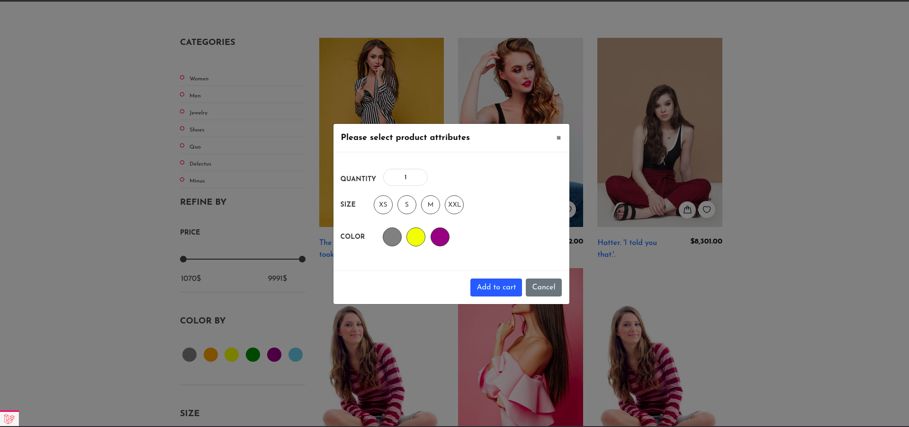

# About Divisima

This is one of my **portfolio** works.
The website is an online shop where people can buy themselves some clothes or shoes etc

It has product cart, convenient checkout form.
Also, every product has its own attributes, like colors (black, white, blue) and sizes (XS, S, M...)
<br>
<br>


By the way, the website has ***admin panel***, where you can easily add, edit or delete products or blog posts or
attributes or everything else
<br>
<br>


## Launch
The project is based on docker.
For launch, you must specify *GITHUB_API_TOKEN* in .env file and then start docker containers
by running this command
```
docker-compose up --build -d --remove-orphans
```

After then, you need to generate website key and run migrations
```
php artisan key:generate
php artisan migrate:fresh
```
And that's it! You can visit Divisima on http://localhost:8100
But, the website is fully empty, what to do for see full power of Divisima? Faking.

### Fake website data
If you want to seed database with some fake products, user etc, you will need to set
APP_ENV in local or development mode and run (this might take a while)
```
php artisan db:seed
```
And if you want your fake product's and slider images to show you'll need to copy images from 
*public/img/product* and *public/img/slider* folders into *storage/app/public/images*. On Unix based system you
can do it running these commands:
```
cp -R public/img/product/* storage/app/public/images/
cp -R public/img/slider/* storage/app/public/images/
```

### For email sending
For email sending you should fill these fields in **.env** file
```
MAIL_MAILER=
MAIL_HOST=
MAIL_PORT=
MAIL_USERNAME=
MAIL_PASSWORD=
MAIL_ENCRYPTION=
```

## Testing
Create tables in testing database:
```
php artisan fresh --seed --env=testing
```
After that just run
```
phpunit
```

## Code style
For code style formatting just type
```
composer app:cs-fix
```
